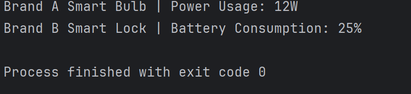
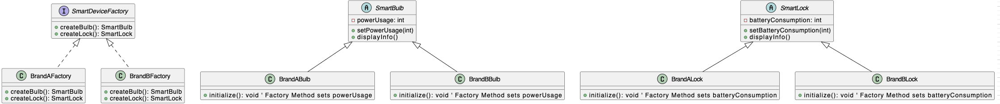

# Assignment 1: Design Patterns

## Project Structure
- `src/factory/` → Contains the Abstract Factory and concrete factories (BrandAFactory, BrandBFactory).
- `src/products/` → Contains abstract product classes (SmartBulb, SmartLock) and concrete products for each brand.
- `src/util/` → Contains `UsageFactory` to load usage values from `data.txt`.
- `test/` → Contains `MainTest.java` which demonstrates the functionality.
- `data.txt` → Simulates an external database with usage values.
- `screenshots/` → Contains screenshots for UML diagram and program output.

## Test Methods
- `MainTest` creates:
  - A **Brand A Bulb** (power usage read from `data.txt`).
  - A **Brand B Lock** (battery consumption read from `data.txt`).

### Sample Output
```
Brand A Smart Bulb | Power Usage: 12W
Brand B Smart Lock | Battery Consumption: 25%
```

### Execution Screenshot
Below is a screen dump from the IntelliJ console showing the actual program output:



## UML Diagram
The following diagram shows the Abstract Factory and Factory Method design:


